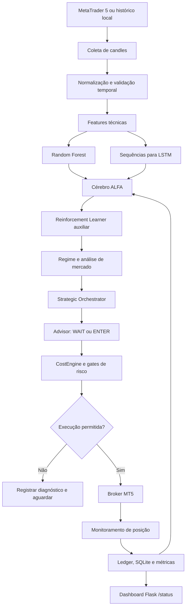

# Arquitetura do ALFA Advisor

## Objetivo

O ALFA Advisor organiza um pipeline experimental de pesquisa e decisão para séries temporais de mercado em candles M15. O desenho atual concentra a maior parte das responsabilidades em `src/alfa_advisor.py`, o que facilita a execução inicial, mas também evidencia uma oportunidade clara de refatoração por domínios.

## Fluxo principal

## Componentes

| Componente | Responsabilidade | Evidência no código |
| --- | --- | --- |
| `MLMetricsStore` | Consolida métricas de treino e acurácia online. | Arquivos JSON/CSV e estado protegido por lock. |
| `ExecutionLedger` | Registra eventos de execução e resultados. | Persistência local em SQLite. |
| `IntelligentAdvisor` | Produz uma decisão contextual com critérios de confiança, edge e histórico. | Ações `WAIT` e `ENTER`, com registro de decisões. |
| `SafetyVault` | Centraliza proteções operacionais e estado de segurança. | Limites de perdas, cooldowns e bloqueios. |
| `CalendarioEconomico` | Consulta eventos econômicos e aplica janela de proteção. | Cache e filtro de eventos de alto impacto. |
| `AnaliseMercado` | Calcula contexto técnico e regime de mercado. | Tendência, volatilidade, ADX, RSI, MACD e suportes/resistências. |
| `SmartMoneyConcepts` | Acrescenta sinais de estrutura e liquidez. | Componente dedicado de análise SMC. |
| `AnaliseCorrelacao` | Observa relação entre ativos para controlar exposição correlacionada. | Diagnóstico multiativo. |
| `ReinforcementLearner` | Mantém uma tabela de estados e recompensas como componente experimental. | Estado, epsilon e recompensa por resultado. |
| `LSTMPredictor` e `CerebroAlfa` | Treinam, carregam e usam modelos de sequência e classificação. | Persistência de modelos e métricas. |
| `GerenciadorEstrategias` | Mantém desempenho histórico por estratégia. | Sete estratégias e seleção por confiança. |
| `StrategicOrchestrator` | Escolhe uma estratégia coerente com regime e sinais técnicos. | Tendência, MACD, RSI, ADX e padrões de candle. |
| `BrokerMT5Real` | Encapsula conexão, custos, envio, fechamento e reconciliação. | `order_check`, `order_send`, filling alternativo e proteções. |
| `Backtester` | Simula decisões em histórico e gera métricas. | Win rate, lucro, drawdown e Sharpe Ratio. |
| `AlfaDivinaSuprema` | Coordena os loops de operação, resultados, risco e estado. | Loop principal, monitoramento e interface de terminal. |
| Flask dashboard | Expõe visão operacional local. | Rotas `/` e `/status`, atualização no navegador. |

## Decisão e controles

A decisão não depende apenas de uma previsão do modelo. O fluxo combina sinais técnicos, regime de mercado, força da estratégia, memória histórica, confiança calibrada, edge líquido estimado e limites de capacidade. Mesmo quando a decisão é considerada elegível, os gates de spread, slippage, perda diária, drawdown, número de posições e cooldown podem impedir a execução.

Esse desenho é importante para o portfólio porque demonstra uma preocupação com **sistemas de decisão auditáveis**, em vez de apresentar Machine Learning como uma caixa-preta isolada.

## Limitações conhecidas

A versão atual ainda concentra muitas responsabilidades em um único módulo, possui dependência operacional do MetaTrader 5 e não oferece um parâmetro nativo de `dry-run` que impeça todos os caminhos de envio de ordens. Também não há, neste repositório, uma suíte abrangente para comprovar a robustez estatística dos resultados.

A evolução recomendada é dividir o código em módulos de dados, features, modelos, risco, execução e apresentação; adicionar interfaces para broker simulado; implementar testes unitários e de integração; e separar explicitamente os modos `backtest`, `paper` e `live`.
